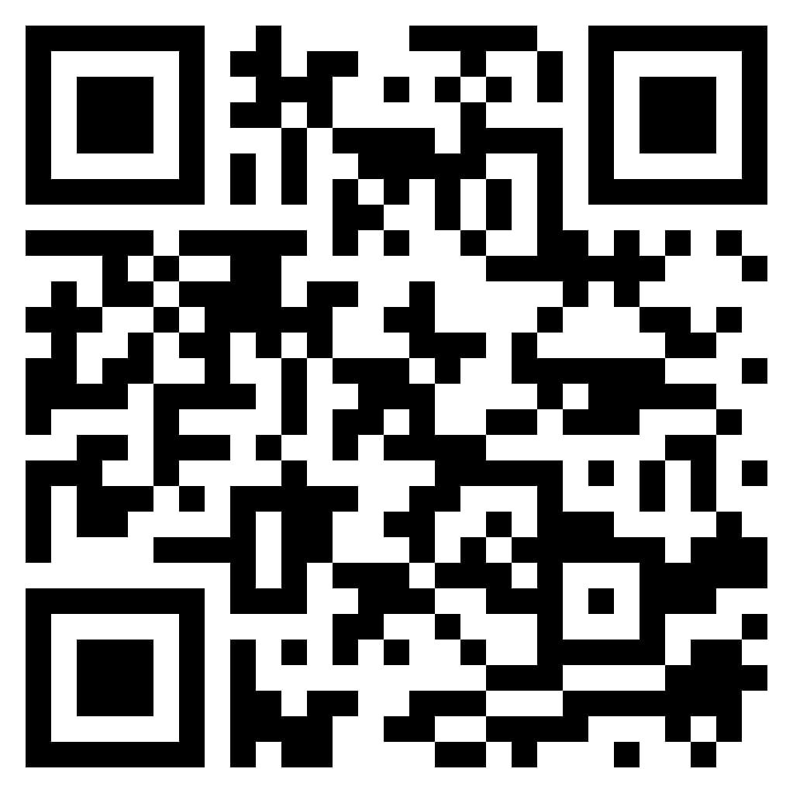

# 🖼️ Canvas Clue🚔 - A Data Mystery Event

**Website Link**
[Click here!](https://nh-canvas-clue.netlify.app/)

Welcome to **Canvas Clue** – the ultimate data-driven mystery event! Hosted by **Neural Hive x Maaya**, this event challenges participants to harness data analysis and foundational machine learning skills to prevent a major art heist. Compete against other teams to collect clues, solve puzzles, and stop the heist, with a prize pool of ₹5000 up for grabs for the top teams!

## 🌌 Event Overview
**Canvas Clue** invites you to join the **Multimodal Multiverse** for a thrilling mystery-solving adventure where you analyze diverse datasets, uncover clues, and race to crack the case!

- **Mission**: Analyze custom datasets to uncover clues related to a painting theft, pinpointing details like the targeted artwork, the date of the crime, the crime syndicate, and the timing of the heist.
- **Challenge Format**: Tackle 4 complex clue-finding challenges, applying data cleaning, outlier analysis, and introductory ML techniques.

### ✨ Event Highlights:
- Dive into real-world data challenges inspired by sitcoms, iconic characters, and hip-hop legends.
- Learn foundational ML concepts and apply them to solve the mystery.
- Opportunity to win from a ₹5000 prize pool, with e-certificates for all participants!

### 📅 Event Details:
- **Teams**: 2-3 members
- **Date**: November 6, 2024
- **Time**: 1:30 PM - 5:00 PM
- **Venue**: Seminar Hall 1
- **Registration Fee**: ₹250 per team
- **Contacts**: Tanistha (8197837486), Rishit (9035821386)

### 📳 Social Media
For event updates and announcements, follow us on Instagram: [Neural Hive Profile](https://www.instagram.com/neuralhive/profilecard/?igsh=MWJ3ZXhzbG92eHF2).

---

## 📂 Repository Structure
This repository contains the official website for the **Canvas Clue** event, including:
- **Documentation**: Instructions, event details, and information on dataset structure.
- **Questions**: Dataset challenges and accompanying questions for each clue-finding task.
- **Resources**: Additional guides on data analysis and basic ML techniques to help participants during the event.

---

## 🔍 QR Code
Scan the QR code below to directly access the **Canvas Clue** event website!

 <!-- Replace this path with the actual path of your QR code image -->

## 📞 Contact
For any questions about the event or repository:
- **Tanistha**: 8197837486
- **Rishit**: 9035821386

---

**Canvas Clue** is your opportunity to shine in data analysis and machine learning. Register today, bring your detective skills, and prepare to stop the heist! 🎉
